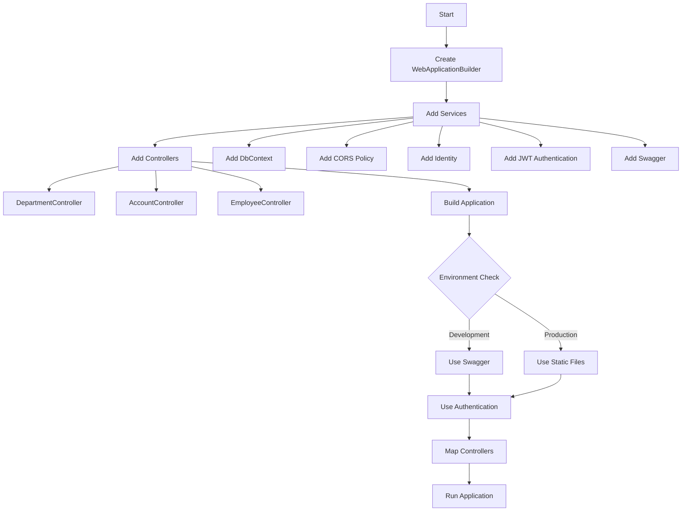

# Department API

This project is a web application built using ASP.NET Core, which includes several key components and services to manage departments, employees, and user accounts. The application is structured with a focus on modularity and security, utilizing various ASP.NET Core features.

## Table of Contents
- [Technologies Used](#Technologies)
- [Installation](#installation)
- [Usage](#usage)
- [Features](#features)
- [Configuration](#configuration)
- [Contributing](#contributing)
- [License](#license)

## Technologies
###

<div align="left">
  
  
  
  
  
  
  
  
  
  
  
  
  
</div>

###

<div align="left">
</div>

###

## Installation

1. Clone the repository:
   ```bash
   git clone https://github.com/yourusername/department-api.git
   ```
2. Navigate to the project directory:
   ```bash
   cd department-api
   ```
3. Restore the dependencies:
   ```bash
   dotnet restore
   ```
4. Update the `appsettings.json` file with your database connection string and JWT settings.

## Usage

1. Run the application:
   ```bash
   dotnet run
   ```
2. Access the API documentation at `http://localhost:5000` (or your configured port).

## Features

- **JWT Authentication**: Secure your API with JSON Web Tokens.
- **CORS Policy**: Configured to allow requests from `http://localhost:4200`.
- **Swagger**: Integrated for API documentation and testing.

## Configuration

- **Database**: Update the connection string in `appsettings.json` under `ConnectionStrings:DefaultConnection`.
- **JWT**: Configure the JWT settings in `appsettings.json` under `Jwt`.

## Contributing

Contributions are welcome! Please fork the repository and submit a pull request.

## License

This project is licensed under the MIT License. See the [LICENSE](LICENSE) file for details.
